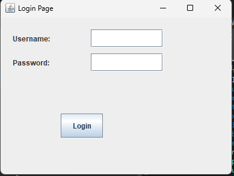
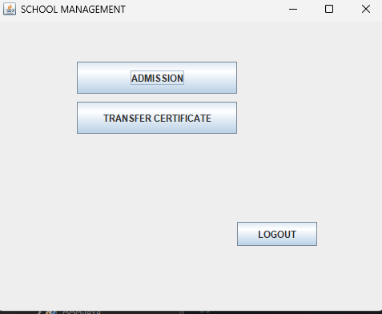
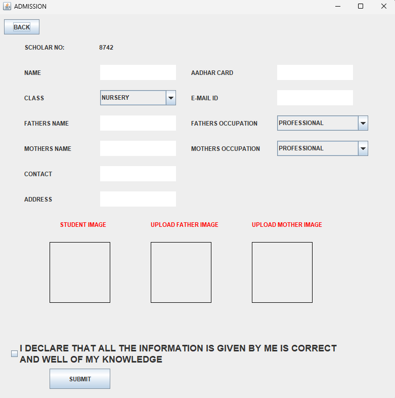
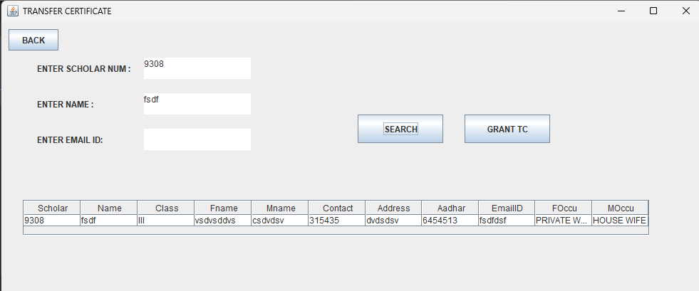
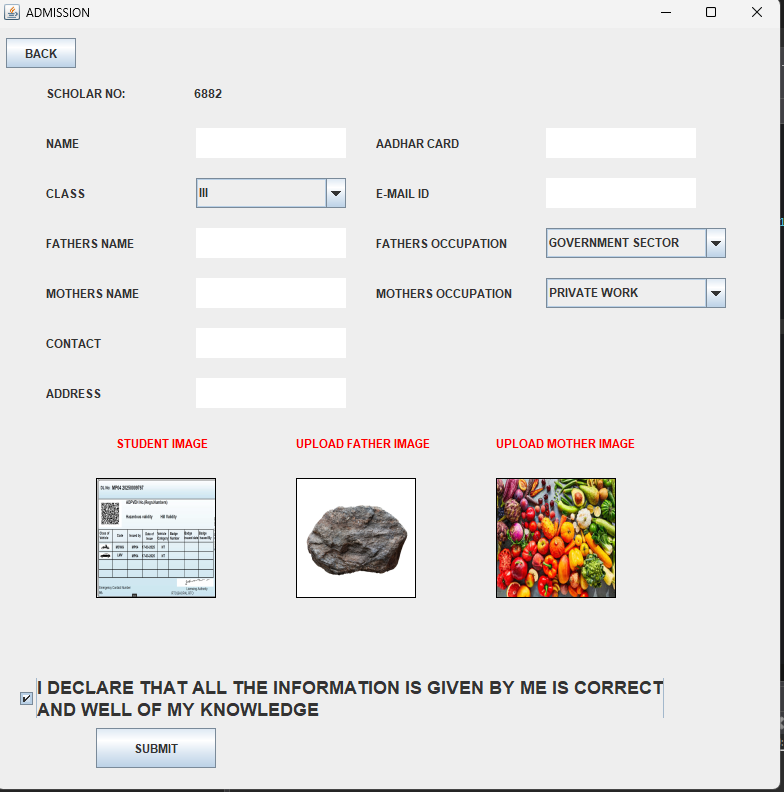
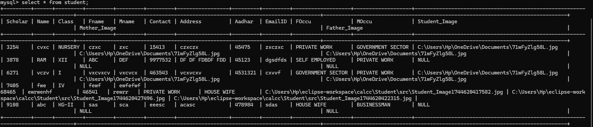
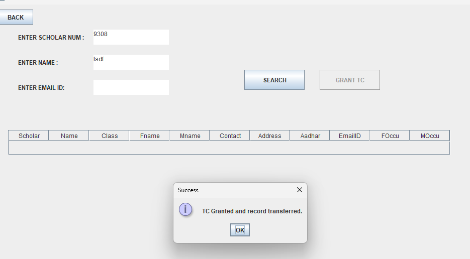
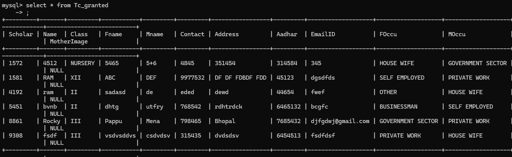

# Student_Management# School Management System


A complete school management solution handling student admissions and transfer certificates with secure database integration.

## Table of Contents
- [Features](#features)
- [Screenshots](#screenshots)
- [Installation](#installation)
- [Database Setup](#database-setup)
- [Class Diagram](#class-diagram)
- [Dependencies](#dependencies)
- [Contact](#contact)

## Features
| Module | Key Functionality |
|--------|-------------------|
| **Authentication** | Secure login system with credential validation |
| **Admission** | - Student/parent details capture<br>- Image upload (JPG/PNG)<br>- Automatic scholar number generation<br>- Data validation |
| **Transfer Certificate** | - Student search by scholar number<br>- TC granting with record transfer<br>- Database maintenance |
| **Database** | - MySQL integration<br>- Separate tables for active/TC students<br>- Prepared statements for security |
| **UI** | - Swing-based interface<br>- Form validation<br>- Image preview functionality |

## Screenshots
| Login | Main Menu | Admission | TC Management |
|-------|-----------|-----------|---------------|
|  |  |  |  | | |
 | |
## Installation

### Prerequisites
- Java JDK 17+
- MySQL Server 8.0+
- MySQL Connector/J 8.0
- Maven (optional)

1. **Clone Repository**
   ```bash
   git clone https://github.com/yourusername/school-management-system.git
   cd school-management-system

## Dependencies

Add these to your `pom.xml`:

```xml
<dependencies>
    <!-- MySQL Connector -->
    <dependency>
        <groupId>mysql</groupId>
        <artifactId>mysql-connector-java</artifactId>
        <version>8.0.33</version>
    </dependency>
</dependencies>
```
</dependencies>


## Build Project
```bash
mvn clean install # For Maven projects
```

## Database Setup
1. Create Database and Tables:
```sql
CREATE DATABASE project;
USE project;

-- Active Students Table
CREATE TABLE Student (
    Scholar VARCHAR(10) PRIMARY KEY,
    Name VARCHAR(100) NOT NULL,
    Class VARCHAR(10) NOT NULL,
    Fname VARCHAR(100) NOT NULL,
    Mname VARCHAR(100) NOT NULL,
    Contact VARCHAR(15) NOT NULL,
    Address VARCHAR(200) NOT NULL,
    Aadhar VARCHAR(12) UNIQUE,
    EmailID VARCHAR(100),
    FOccu VARCHAR(50),
    MOccu VARCHAR(50),
    Student_Image VARCHAR(200),
    Father_Image VARCHAR(200),
    Mother_Image VARCHAR(200)
);

-- TC Granted Students Table
CREATE TABLE TC_Granted (
    TC_ID INT AUTO_INCREMENT PRIMARY KEY,
    Scholar VARCHAR(10) UNIQUE,
    Name VARCHAR(100),
    Class VARCHAR(10),
    Fname VARCHAR(100),
    Mname VARCHAR(100),
    Contact VARCHAR(15),
    Address VARCHAR(200),
    Aadhar VARCHAR(12),
    EmailID VARCHAR(100),
    FOccu VARCHAR(50),
    MOccu VARCHAR(50),
    Grant_Date TIMESTAMP DEFAULT CURRENT_TIMESTAMP
);
```

2. Create Image Directories:
```bash
mkdir -p src/main/resources/images/{students,fathers,mothers}
```
## Contact

[Ram Vishwakarma] - [rv7029919@gmail.com]  

📧 Report Issues:  
[https://github.com/Ramvish108/student-management/issues](https://github.com/Ramvish108)  

🔗 Project Repository:  
[https://github.com/Ramvish108/student-management](https://github.com/Ramvish108/Student_Management)

## Login
- **Default Credentials**: 123/123
- Password masked input

## Admission Process
1. Complete all mandatory fields (marked with *)
2. Upload images (Student + Parents)
3. Verify data before submission
4. System generates scholar number automatically
## Class Diagram

```mermaid
classDiagram
    class studd {
        -JFrame f1, f, f2, f3
        -JButton b, b1, b0, bs, b00, loginButton
        -JTextArea a1, a3, a4, a5, a6, a11, a12, a13, a14, a2
        -Connection con
        -PreparedStatement pst
        -ResultSet rs
        +studd()
        +LoginPage()
        +admission()
        +transfer()
        +connection()
        +Randomnum()
        +selectAndDisplayImage()
    }
    
    studd --> Database
    studd --> SwingComponents
    
    class Database {
        +Connection con
        +connect()
        +insertStudent()
        +grantTC()
        +searchStudent()
    }
    
    class SwingComponents {
        +JFrame
        +JButton
        +JTextArea
        +JLabel
        +JTable
    }


